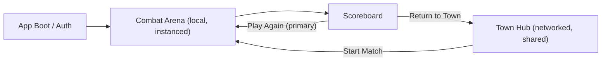
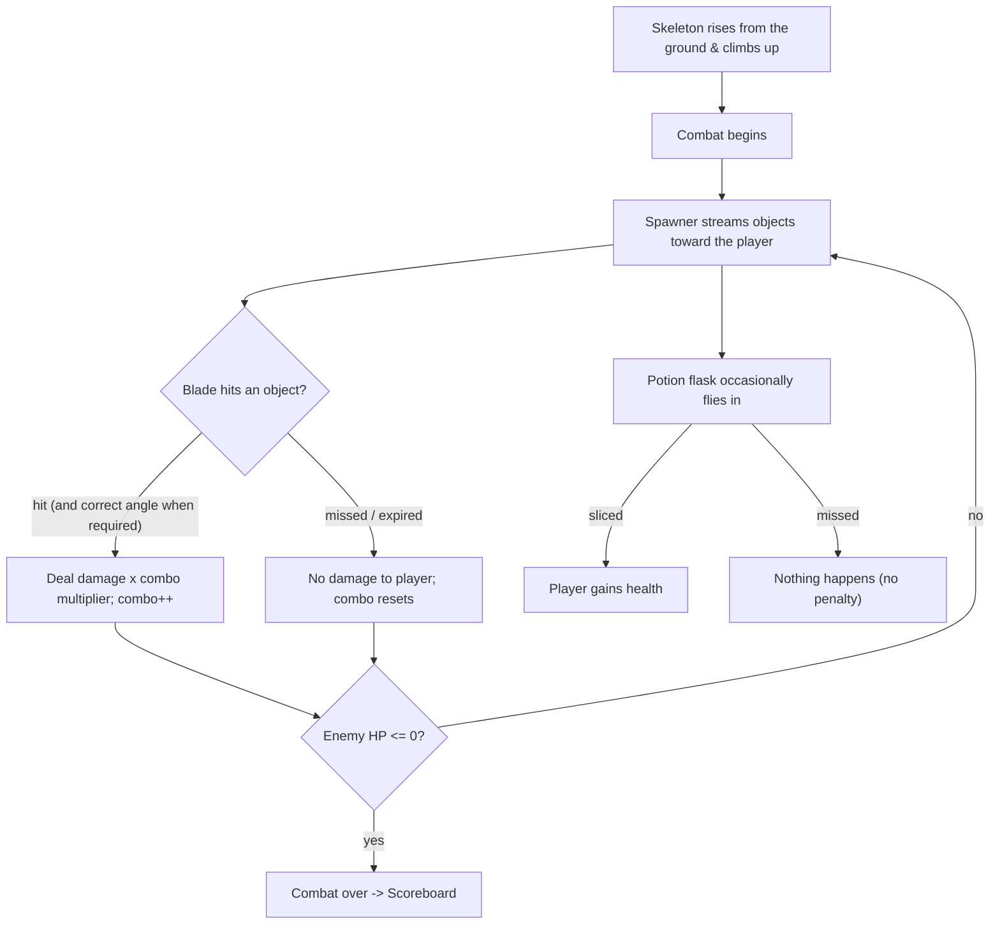

# 01 - Game Design Document

## Vision

A fast, visceral, "one more round" VR combat game. The player feels like a sword-wielding hero who
destroys incoming threats with precise, rhythmic slicing to defeat a fantasy enemy. It is immediately
playable (no menus to start the first fight), short-session friendly, and social between matches.

Think: the slicing satisfaction of a rhythm slasher, framed as fantasy melee combat against a living
enemy, wrapped in a casual multiplayer social hub.

## Pillars

1. **Instant action.** App launch drops you straight into a fight - no menu wall.
2. **Slicing feels great.** Responsive blades, clear feedback (visual/haptic/audio) on every hit.
3. **Risk-free aggression.** Missing never damages you, so players are encouraged to swing freely and
   chase big combos.
4. **Always one more round.** The post-match flow puts "Play Again" front and center.
5. **Social, not lonely.** A shared town hub gives the game multiplayer presence without complicating
   the combat.

## Core game flow

Notes:
- The very first session goes straight into combat (pillar 1). The town hub is reached after a match,
  or chosen explicitly later.
- "Play Again" is the prominent, default-focused button on the scoreboard.

## Combat loop

## Detailed mechanics

### Arena setup
- Player stands in a beautiful outdoor, grassy landscape.
- An enemy skeleton is positioned a few meters in front of the player.
- The space between player and enemy is the "lane field" where objects travel toward the player.
- There is deliberate extra distance between player and enemy so objects have travel time and the
  player reads/reacts to them.

### Intro sequence
- On combat start, the skeleton emerges from the ground (rise + climb animation), telegraphing the
  fight. Combat input is locked until the rise completes.

### Hands as swords
- Left and right hands each carry a blade. The player slices by moving their hands through objects.
- A hit registers when a blade collider passes through a sliceable object with sufficient speed.
- Some objects must be hit at a specific **angle** (e.g. a directional cut) for full credit; others
  just need to be hit at all. The required angle is communicated visually on the object.

### Scoring & combos
- Each successful slice deals base damage to the enemy.
- A **combo counter** increases with each consecutive successful slice and resets on a miss/expiry.
- The combo drives a **damage multiplier** with tiers (e.g. x1 -> x2 -> x4 -> x8). Higher combo =
  more damage per slice.
- Correct-angle hits award more than "hit at all" hits and may grant bonus combo.

### Potions (healing)
- Periodically a potion flask is thrown toward the player among the regular objects.
- Slicing it grants health back to the player.
- Missing it does nothing (consistent with "missing never hurts").

### Player health & fail state
- The player has health. Objects that are NOT sliced do **not** damage the player on miss (pillar 3).
- (Design hook for later difficulty: certain "threat" objects could damage the player if they reach
  them - kept OUT of the first version to honor the no-penalty pillar. If introduced, it must be
  clearly distinct from normal sliceables.)
- The match ends when the enemy's HP reaches zero (win). A loss condition (player HP to zero) is a
  later difficulty option, not part of M1.

### Difficulty ramp
- Spawn rate and object speed increase over the match.
- Angle-required objects become more frequent as the fight progresses.

## Scoreboard

Shown when combat ends. Displays at minimum:
- Total score / damage dealt.
- Highest combo reached.
- Accuracy (objects sliced / objects spawned).
- Potions collected.
- Time / duration.

Buttons:
- **Play Again** - primary, prominent, default focus. Restarts a fresh combat immediately.
- **Return to Town** - secondary. Sends the player to the shared town hub.

## Town hub (shared multiplayer)

- A town square where multiple players are present together (reusing the template's networked avatars,
  voice, name tags).
- Players can see and talk to each other before starting another match.
- A clearly presented **Start Match** action lets a player jump into a new (instanced, solo) combat at
  any time.
- The town is the only place where networking matters for gameplay; combat itself is local.

## Out of scope for the first version

- Co-op or competitive synced combat (see `05_Multiplayer.md` for the extension path).
- Player-damage/lose condition during combat.
- Progression, currency, cosmetics, multiple enemy types/biomes (post-launch candidates).

## Open design questions (track here, decide before relevant milestone)

- Exact combo tier thresholds and multiplier values (tuning pass during M1/M2).
- Whether angle requirement uses 4-direction cuts or free-angle tolerance.
- Number of spawn lanes and their layout in the lane field.
- Enemy HP scaling and target match length (aim for short, ~60-120s sessions).
