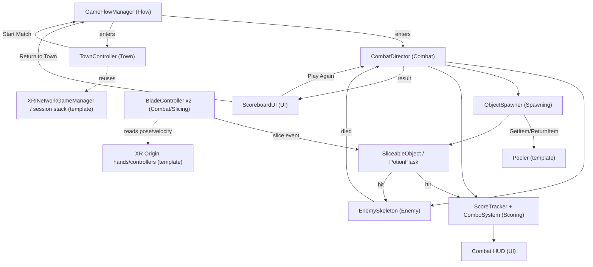
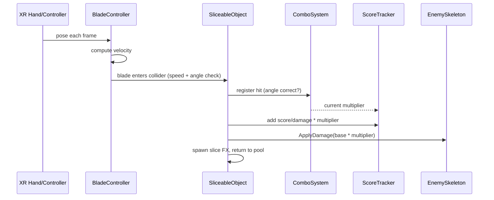

# 03 - Architecture

This document defines how our game code is organized and how it plugs into the VR Multiplayer
Template. Read `02_ProjectKnowledgeBase.md` first for the template APIs referenced here.

## Principles

1. **Build on top, don't fork.** Our code lives in `Assets/Game/` (assembly `FantasyVR.Game`,
   namespace `FantasyVR`). Template code in `Assets/VRMPAssets/` stays as-is.
2. **Combat is local.** No networking in the combat simulation. This keeps it simple, performant, and
   cheat-proof-by-irrelevance.
3. **Networking only where it matters.** The town hub reuses the template's session/lobby/voice/avatar
   stack unchanged.
4. **GameObject + MonoBehaviour + ScriptableObject.** No ECS. Config lives in ScriptableObjects so
   designers tune without code.
5. **Single scene + states/areas (M1).** Follow the template: Town and Combat are areas/states within
   `SampleScene`, transitioned via enable/disable + teleport. Multi-scene is a later optimization (see
   "Scene strategy").

## Assembly & namespace

- Assembly: `FantasyVR.Game` (`Assets/Game/FantasyVR.Game.asmdef`).
- Root namespace: `FantasyVR`, with sub-namespaces matching folders, e.g. `FantasyVR.Combat`,
  `FantasyVR.Combat.Slicing`, `FantasyVR.Enemy`, `FantasyVR.Scoring`, `FantasyVR.Spawning`,
  `FantasyVR.Flow`, `FantasyVR.Town`, `FantasyVR.UI`, `FantasyVR.Config`.
- References the template assembly `VRMP` plus XRI, XR Hands, Netcode, Input System, TextMeshPro so we
  can call `Pooler`, `XRINetworkGameManager`, etc.

## Folder layout (`Assets/Game/`)

```
Assets/Game/
  FantasyVR.Game.asmdef
  Flow/            GameFlowManager, GameState enum, area transitions
  Combat/          CombatDirector, CombatConfig, player health
    Slicing/       BladeController, Blade, hand velocity tracking, slice detection
  Enemy/           EnemySkeleton (rise/climb, HP, death), enemy config
  Spawning/        ObjectSpawner, lane definitions, sliceable/potion poolers
  Scoring/         ComboSystem, ScoreTracker, CombatResult data
  UI/              ScoreboardUI, in-combat HUD (combo, enemy HP, player HP)
  Town/            TownController, Start Match interaction
  Config/          ScriptableObject assets (CombatConfig, EnemyConfig, etc.)
  ScriptableObjects/  (asset instances)
  Prefabs/         our prefabs (blades, sliceables, potion, enemy, UI)
```

## High-level component map



## Core systems

### GameFlowManager (`FantasyVR.Flow`)
- Owns the top-level state machine: `Boot -> Combat -> Scoreboard -> (Combat | Town)`, and
  `Town -> Combat`.
- `enum GameState { Boot, Combat, Scoreboard, Town }`.
- Activates/deactivates the Combat area and Town area roots; positions/teleports the player using XRI's
  `TeleportationProvider` (same approach as `MiniGameManager.TeleportToArea`).
- On first launch, transitions straight to `Combat` (pillar: instant action).
- Provides `StartCombat()`, `ShowScoreboard(CombatResult)`, `GoToTown()` entry points called by the
  director/UI.

### CombatDirector (`FantasyVR.Combat`)
- Orchestrates one combat encounter: triggers the enemy rise intro, starts the spawner, runs the
  difficulty ramp, listens for enemy death, then produces a `CombatResult` and tells `GameFlowManager`
  to show the scoreboard.
- Holds references to `EnemySkeleton`, `ObjectSpawner`, `ScoreTracker`, `ComboSystem`, player health.
- Reads tuning from a `CombatConfig` ScriptableObject.

### BladeController + Blade (`FantasyVR.Combat.Slicing`)
- One per hand. Tracks the hand/controller transform, computes per-frame velocity (transform delta or
  XR Hands velocity API), and exposes a blade collider used for slice detection.
- Raises slice events consumed by `SliceableObject`. See `04_CombatSystem.md` for detection details.

### ObjectSpawner (`FantasyVR.Spawning`)
- Streams sliceable objects (and occasional potions) toward the player along configured lanes.
- Uses `Pooler` subclasses for sliceables and potions (no networking).
- Spawn rate / speed / angle-requirement frequency scale via the difficulty ramp from `CombatDirector`.

### Scoring (`FantasyVR.Scoring`)
- `ComboSystem`: tracks consecutive hits, current multiplier tier, resets on miss.
- `ScoreTracker`: accumulates score, damage dealt, accuracy stats, potions collected.
- `CombatResult`: plain data struct passed to the scoreboard.

### EnemySkeleton (`FantasyVR.Enemy`)
- Rise/climb intro animation, HP, takes damage from sliced objects, plays hit/death feedback, raises a
  `Died` event.

### UI (`FantasyVR.UI`)
- In-combat HUD: enemy HP, combo/multiplier, player HP.
- `ScoreboardUI`: world-space panel built like the template's minigame scoreboard, with `Play Again`
  (primary) and `Return to Town` buttons wired via `TextButton.UpdateButton`.

### TownController (`FantasyVR.Town`)
- Manages the shared hub area. Ensures the player is connected (or connects via
  `XRINetworkGameManager`) and presents a prominent **Start Match** interaction that calls
  `GameFlowManager.StartCombat()`.

## Integration points with the template

- **Player rig:** blades attach to the local XR Origin's controller/hand transforms (see
  `02_ProjectKnowledgeBase.md` - hands section).
- **Pooling:** combat objects use `XRMultiplayer.Pooler`.
- **Connection state:** `TownController` reads `XRINetworkGameManager.Connected` and uses
  `LobbyUI`/`QuickJoinLobby()` for joining.
- **Teleport/areas:** reuse XRI `TeleportationProvider`, mirroring `MiniGameManager.TeleportToArea`.
- **UI:** reuse `TextButton`, world-space canvas + `XRUIInputModule` patterns and the UI prefab
  library.

## Scene strategy

- **M1 (now):** Work inside `SampleScene`. Add a Combat area root and a Town area root; toggle between
  them. This matches the template's single-scene model and avoids networked scene-load complexity.
- **Later (optional):** If combat and town diverge heavily (lighting, occlusion, perf), split into
  separate scenes loaded additively, keeping the network/managers in a persistent bootstrap scene.
  Only do this if profiling justifies it.

## Data flow for one slice (sequence)


