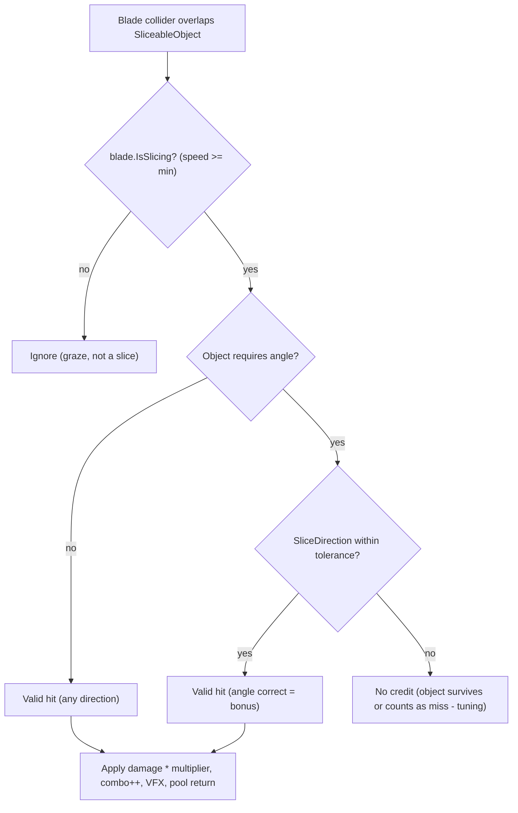

# 04 - Combat System (implementation-ready design)

This is the detailed spec for the core combat loop (Milestone M1). It is written so the next prompt can
implement it directly. All types live in `Assets/Game/` (assembly `FantasyVR.Game`).

## Overview

Combat is a fully local, single-player simulation. A skeleton enemy rises, the spawner streams objects
toward the player through a lane field, and the player slices them with hand-mounted blades. Each
slice deals damage scaled by a combo multiplier. Potions heal. Missing never penalizes the player. The
enemy reaching 0 HP ends the encounter and opens the scoreboard.

## Coordinate model & lane field

- Define a `CombatRig` root placed in front of the player at combat start.
- `playerAnchor` = where the player stands. `enemyAnchor` = a few meters ahead (e.g. 4-6 m).
- The **lane field** is the volume between them. Objects spawn near the enemy side and travel toward
  the player along configured **lanes** (spawn points with a target point near the player's reach).
- Lanes are arranged in a grid the player can comfortably reach (roughly shoulder-to-waist height,
  left-center-right). Number/positions come from `CombatConfig`.

## Types and responsibilities

### Config (ScriptableObjects, `FantasyVR.Config`)
- `CombatConfig` - match-level tuning:
  - enemy HP, match target duration.
  - spawn interval curve (start/end interval over time), object speed curve.
  - potion spawn chance + min interval, potion heal amount.
  - angle-required object probability curve.
  - player max health, starting health.
- `EnemyConfig` - rise duration, hit reaction, death sequence timing.
- `ComboConfig` - tier thresholds and multipliers (e.g. tiers at 0/5/10/20 hits -> x1/x2/x4/x8) and
  bonus combo for correct-angle hits.
- `LaneLayout` - lane spawn/target points (can be authored on the prefab instead; ScriptableObject
  optional).

### BladeController (`FantasyVR.Combat.Slicing`)
One instance per hand.
- Serialized: `Handedness hand`, blade collider reference, `minSliceSpeed`.
- Each `Update`/`FixedUpdate`: read the bound hand transform (from the local XR rig - see KB doc),
  store position history, compute `Velocity` and `SliceDirection` (normalized velocity).
- Provides `bool IsSlicing => Velocity.magnitude >= minSliceSpeed` and current `SliceDirection`.
- Drives blade visuals (trail) and triggers haptics on a confirmed slice.
- Hand binding: resolve `XROrigin` + `XRInputModalityManager` at start (mirror
  `XRHandPoseReplicator.SetupLocalHands()`); support both controller and hand-tracking modes.

Velocity computation (copy the template's `NetworkPhysicsInteractable.GetWorldVelocity()` idea):
```csharp
Vector3 velocity = (currentPos - lastPos) / Time.deltaTime;
```
When in tracked-hand mode, optionally prefer `XRHandJoint.TryGetLinearVelocity()` for a smoother value.

### SliceableObject (`FantasyVR.Spawning`)
- The flying object the player slices. Has a trigger collider, a `Rigidbody` (kinematic, moved by the
  spawner or by velocity), visuals, and an optional **required cut direction**.
- Detection: when a blade collider overlaps (OnTriggerEnter / overlap test) AND
  `blade.IsSlicing == true`:
  - If the object requires an angle, compare `blade.SliceDirection` against the required direction
    within a tolerance; full credit only if within tolerance, otherwise either no credit or partial
    (decide in tuning - default: must match for "angle" objects, free for "any" objects).
  - On valid hit: call back to `CombatDirector`/`ScoreTracker` with hit quality, spawn slice VFX
    (two halves or a burst), return self to the pool.
- Expiry: if the object passes the player or its lifetime ends without being hit, report a **miss**
  (combo reset) and return to pool. A miss never damages the player.

### PotionFlask (`FantasyVR.Spawning`)
- A special sliceable that, on valid slice, calls `PlayerHealth.Heal(amount)` instead of dealing enemy
  damage. Distinct visual (glowing flask). Missing it does nothing.

### ObjectSpawner (`FantasyVR.Spawning`)
- Owns a `SliceablePooler` and a `PotionPooler` (subclasses of `XRMultiplayer.Pooler`).
- On `Begin(CombatConfig)` starts a spawn coroutine driven by the difficulty ramp:
  - pick a lane, `GetItem()` from the pool, position at the lane's spawn point, set velocity/path
    toward the lane's target point, decide angle-requirement via probability curve.
  - roll potion chance; if hit and min-interval satisfied, spawn a potion instead/in addition.
- `Stop()` halts spawning and returns active objects to their pools.
- Difficulty: `CombatDirector` provides normalized progress (0..1 over the match or by enemy HP %),
  used to sample the spawn-interval / speed / angle-prob curves.

### ComboSystem (`FantasyVR.Scoring`)
- `int Combo`, `int MultiplierTier`, `float Multiplier`.
- `RegisterHit(bool angleCorrect)` -> increments combo (+bonus if angleCorrect), recomputes tier from
  `ComboConfig`, raises `OnComboChanged`.
- `RegisterMiss()` -> resets combo to 0, raises `OnComboChanged`.
- `Multiplier` is read by scoring/damage.

### ScoreTracker (`FantasyVR.Scoring`)
- Accumulates: total score, damage dealt, objects spawned, objects sliced (for accuracy), highest
  combo, potions collected, start time.
- `BuildResult()` -> `CombatResult` for the scoreboard.

### PlayerHealth (`FantasyVR.Combat`)
- `float Current`, `float Max`, `Heal(float)`, `Damage(float)` (Damage unused in M1 per no-penalty
  pillar; kept for later difficulty), `OnHealthChanged`.

### EnemySkeleton (`FantasyVR.Enemy`)
- States: `Rising -> Active -> Dying`.
- `Rise()` plays the climb-out-of-ground animation; raises `OnRiseComplete` to unlock combat.
- `ApplyDamage(float)` reduces HP, plays hit reaction, raises `OnDamaged`; at <=0 transitions to
  `Dying`, plays death sequence, raises `OnDied`.

### CombatDirector (`FantasyVR.Combat`)
Orchestration:
1. `StartCombat()` (called by `GameFlowManager`): reset score/combo/health, position the `CombatRig`,
   call `enemy.Rise()`. Input/spawning locked until `OnRiseComplete`.
2. On rise complete: `spawner.Begin(config)`, start difficulty ramp.
3. Subscribe to slice hits: route damage to `enemy.ApplyDamage(baseDamage * combo.Multiplier)` and
   `score.AddHit(...)`; route misses to `combo.RegisterMiss()` + `score.AddMiss()`; route potion hits
   to `playerHealth.Heal(...)`.
4. On `enemy.OnDied`: `spawner.Stop()`, build `CombatResult`, call
   `GameFlowManager.ShowScoreboard(result)`.

## Slice detection algorithm (default)



Default tuning decisions (revisit during M1 tuning):
- `minSliceSpeed`: start ~1.5 m/s; tune for comfort.
- Angle tolerance: ~35 degrees half-angle.
- "Any" objects: any sliced direction counts. "Angle" objects: must match to score; on wrong
  direction the object is NOT consumed (player can re-slice) and no combo change until it expires.

## Feedback (juice) - required for "slicing feels great"

- Per slice: blade trail, slice VFX (halves/particles), impact SFX, controller haptics.
- Combo: HUD multiplier scales/pulses on tier-up; distinct SFX per tier.
- Enemy: hit flash/stagger; death has a satisfying collapse + VFX.
- Potion: sparkle on heal, health bar flash.

## In-combat HUD (`FantasyVR.UI`)
- Enemy HP bar (world-space, near/above enemy).
- Combo + current multiplier (near hands or lower-center, comfortable to read).
- Player HP (subtle; only meaningful once a damage/lose condition exists).

## What M1 must deliver (acceptance)

- Enter combat -> skeleton rises -> objects stream in -> slicing with both hands deals damage scaled by
  combo -> potions heal -> missing is harmless -> enemy dies -> scoreboard appears.
- Runs in VR on Quest at target framerate (see `06_QuestPublishing.md`).
- All tuning values in ScriptableObjects, not hardcoded.

## Implementation notes / gotchas

- Attach blades to the LOCAL rig hands/controllers, not the networked avatar hands (those are disabled
  locally). See KB doc.
- Use trigger colliders + manual speed gating rather than physics impacts, to avoid jitter at high hand
  speeds; consider sweeping/overlap tests if fast hands tunnel through thin objects.
- Pool everything (sliceables, potions, VFX) to avoid GC spikes on Quest.
- Keep the spawner's active-object list so `Stop()` can return everything cleanly between matches.
