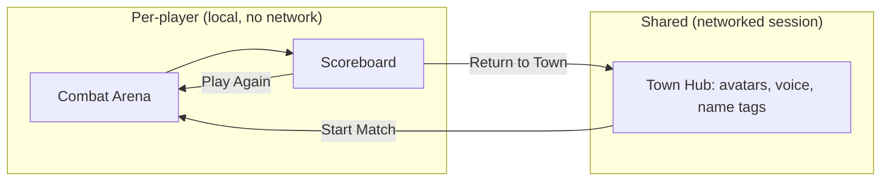

# 05 - Multiplayer

## Model: instanced combat + shared town hub

- **Combat is single-player and local.** Each player slices their own arena. There is no networked
  enemy, no networked projectiles, no shared combat state. This is a locked decision.
- **The town square is the shared multiplayer space.** Players gather there between matches, see each
  other's avatars, talk via voice, and start their own (solo) matches.

Why this model:
- Combat involves dozens of fast-moving objects per second; networking them is expensive and
  pointless when each player has their own fight.
- It keeps the combat code trivial (no RPCs, no authority, no reconciliation) and frame-rate friendly
  on Quest.
- The social value players want (seeing/talking to others, "lobby" feeling) lives entirely in the hub,
  which the template already solves.

## What we reuse from the template (unchanged)

The town hub is essentially the existing VR Multiplayer Template experience. We reuse, without
modification:
- `XRINetworkGameManager` - singleton, auth + connection state (`Connected` bindable).
- `AuthenticationManager` - anonymous UGS sign-in.
- `SessionManager` - `SessionType.DistributedAuthority` (UGS lobby + relay) or `LocalOnly`.
- Networked player avatar `XRI_Network_Player_Avatar.prefab` (`XRINetworkPlayer`,
  `XRHandPoseReplicator`, IK, name tags).
- Vivox voice (`VoiceChatManager`).
- `LobbyUI` / `OfflineMenu` / `PlayerOptions` for join/create/settings.

See `02_ProjectKnowledgeBase.md` for the exact APIs.

## Distributed Authority (how the hub connects)

The template uses Unity Gaming Services (UGS) **Distributed Authority** sessions:
- On boot, `AuthenticationManager` initializes UGS and signs in anonymously.
- `SessionManager.CreateSession()` / `QuickJoinLobby()` / `JoinLobby()` create/join a UGS session that
  provisions a relay; NGO runs in distributed-authority mode (no dedicated host server - authority is
  distributed across clients, with a session owner).
- `XRINetworkGameManager.Connected` flips true once the local player spawns.
- A `LocalOnly` path exists for direct-IP testing (voice disabled).

We do not need to change any of this for M1. The Town milestone (see roadmap) is mostly: place our
town environment + a `Start Match` interaction into the connected hub and ensure entering/leaving
combat doesn't disturb the network session.

## Interaction between combat and the session

- When a player enters combat, they remain connected to the session (we do NOT disconnect). Combat is
  just a local area/state; other players stay in the town.
- We hide/disable the player's town presence visuals if desired while they're "away" in combat, or
  simply teleport them to the combat area (other players still see their avatar where the network
  syncs it - design choice for the Town milestone: likely show them as "in a match").
- Because combat is local, nothing about it is transmitted. Only normal avatar pose/voice continues.

## Local single-player without a session

For the instant-action first launch (and for offline play), combat must run with **no session at all**.
`GameFlowManager` enters `Combat` directly on boot regardless of `Connected` state. The session is only
required to populate the Town hub with other players. This keeps the core game playable offline and
makes combat testing trivial.

## Extension path: co-op / competitive combat (future, not M1)

If we later want shared combat, the cleanest approaches:

1. **Competitive (parallel arenas, shared scoreboard).** Each player still fights locally; only
   compact score/combo updates are networked (small `NetworkVariable`s / RPCs, like
   `MiniGameManager.SubmitScoreRpc`). A shared results board ranks players. Low bandwidth, reuses the
   local combat sim as-is. This is the recommended first multiplayer combat feature.
2. **Co-op (one shared enemy).** Requires networking the enemy HP and the authoritative spawn stream so
   all players see the same objects. Use Distributed Authority: the session owner drives enemy state
   and spawn seed; slices are reported via RPC and validated. Significantly more complex (authority,
   late-join, desync handling) - only pursue with a clear product reason.

Design the M1 combat code so the scoring layer (`ScoreTracker`) can later emit results to a network
component without touching the simulation. Keep combat simulation and "result reporting" decoupled.

## Testing multiplayer

- Use `com.unity.multiplayer.playmode` (Multiplayer Play Mode) to run multiple virtual players in the
  editor for hub testing.
- `LocalOnly` session type for quick direct-connect tests.
- On-device: build to two Quests and join the same session/lobby.
